# 🚀 Database Migration Guide

## Overview

This guide covers the process of migrating an orchestra from the shared database to a dedicated database. This is typically done for Institution tier customers who require enhanced security, performance, or compliance.

## When to Migrate

### Automatic Triggers (Recommendations)
- Orchestra exceeds 300 musicians
- More than 1,000 requests per month  
- More than 50 active projects
- Custom compliance requirements

### Manual Triggers
- Orchestra requests enhanced security
- Performance issues in shared environment
- Regulatory/compliance requirements
- Upgrade to Institution tier

## Migration Process Overview

```mermaid
graph LR
    A[Orchestra Request] --> B[CEO Approval]
    B --> C[Schedule Migration]
    C --> D[Pre-Migration Check]
    D --> E[Export Data]
    E --> F[Create Dedicated DB]
    F --> G[Import Data]
    G --> H[Verify Migration]
    H --> I[Switch Connection]
    I --> J[Post-Migration Test]
    J --> K[Clean Shared Data]
    K --> L[Migration Complete]
```



## Step-by-Step Migration Process

### 1. Request & Approval

**Orchestra Admin initiates request:**
```typescript
// UI: Orchestra Admin Dashboard
<button onClick={requestMigration}>
  Request Dedicated Database
</button>

// API: POST /api/tenant/request-migration
{
  "reason": "Enhanced security requirements",
  "preferredTimeframe": "July 2025"
}
```

**CEO receives notification and approves:**
```typescript
// Superadmin Dashboard shows pending migrations
interface MigrationRequest {
  tenantId: string
  tenantName: string
  requestedAt: Date
  reason: string
  currentStats: {
    musicians: number
    projects: number
    monthlyRequests: number
    databaseSizeMB: number
  }
}
```

### 2. Schedule Migration

**Best practices for scheduling:**
- During orchestra's off-season (summer/winter)
- Weekend nights for minimal disruption
- At least 1 week advance notice
- Maintenance window: 2-4 hours

```typescript
// Superadmin schedules migration
await scheduleMigration({
  tenantId: "tenant_123",
  scheduledFor: "2025-07-15T02:00:00Z",
  estimatedDuration: "2 hours",
  notifyUsers: true
})
```

### 3. Pre-Migration Checklist

```typescript
async function preMigrationCheck(tenantId: string) {
  const checks = {
    activeUsers: await getActiveUserCount(tenantId),
    runningJobs: await getRunningJobs(tenantId),
    pendingRequests: await getPendingRequests(tenantId),
    databaseSize: await getDatabaseSize(tenantId),
    lastBackup: await getLastBackupTime(tenantId)
  }
  
  // Ensure safe to migrate
  if (checks.activeUsers > 0) {
    throw new Error("Active users detected. Please migrate during off-hours.")
  }
  
  return checks
}
```

### 4. Export Data

```typescript
// lib/migration/export.ts
export async function exportTenantData(tenantId: string): Promise<TenantExport> {
  const db = await getDb(tenantId)
  
  console.log(`Starting export for tenant ${tenantId}...`)
  
  const data = {
    metadata: {
      tenantId,
      exportedAt: new Date(),
      version: "1.0"
    },
    
    // Core musician data
    musicians: await db.musician.findMany({ 
      where: { tenantId },
      include: { qualifications: true }
    }),
    
    // Instruments and positions
    instruments: await db.instrument.findMany({ 
      where: { tenantId },
      include: { positions: true }
    }),
    
    // Ranking system
    rankingLists: await db.rankingList.findMany({
      where: { tenantId },
      include: { rankings: true }
    }),
    
    // Projects and requests
    projects: await db.project.findMany({
      where: { tenantId },
      include: {
        needs: {
          include: {
            files: true,
            requests: {
              include: {
                communicationLogs: true,
                requestTokens: true
              }
            }
          }
        }
      }
    }),
    
    // Email templates
    emailTemplates: await db.emailTemplate.findMany({
      where: { tenantId }
    }),
    
    // Files
    projectFiles: await db.projectFile.findMany({
      where: { project: { tenantId } }
    }),
    
    // Audit logs (last 90 days)
    auditLogs: await db.auditLog.findMany({
      where: {
        tenantId,
        createdAt: { gte: new Date(Date.now() - 90 * 24 * 60 * 60 * 1000) }
      }
    })
  }
  
  // Save to secure storage
  const exportPath = `/secure-exports/${tenantId}-${Date.now()}.json`
  await saveSecureFile(exportPath, JSON.stringify(data, null, 2))
  
  console.log(`Export complete. File size: ${getFileSize(exportPath)}MB`)
  
  return data
}
```

### 5. Create Dedicated Database

```typescript
// lib/migration/create-database.ts
export async function createDedicatedDatabase(
  tenantName: string
): Promise<DatabaseConfig> {
  // Using Neon.tech API
  const response = await fetch('https://console.neon.tech/api/v2/projects', {
    method: 'POST',
    headers: {
      'Authorization': `Bearer ${process.env.NEON_API_KEY}`,
      'Content-Type': 'application/json'
    },
    body: JSON.stringify({
      project: {
        name: `stagesub-${tenantName.toLowerCase().replace(/\s+/g, '-')}`,
        region_id: 'aws-eu-north-1',
        pg_version: 15,
        compute_size: 'k8s-pod-2xl', // 4 vCPUs, 16 GB RAM
        autoscaling_limit_min_cu: 0.5,
        autoscaling_limit_max_cu: 2
      }
    })
  })
  
  const project = await response.json()
  
  return {
    projectId: project.id,
    connectionUri: project.connection_uris[0].connection_uri,
    host: project.endpoints[0].host,
    database: project.databases[0].name
  }
}
```

### 6. Run Migrations on New Database

```typescript
export async function setupDedicatedDatabase(connectionUri: string) {
  // Run Prisma migrations
  const result = await exec(
    `DATABASE_URL="${connectionUri}" npx prisma migrate deploy`
  )
  
  if (result.exitCode !== 0) {
    throw new Error(`Migration failed: ${result.stderr}`)
  }
  
  console.log("Database schema created successfully")
  
  // Create necessary indexes for performance
  const db = new PrismaClient({
    datasources: { db: { url: connectionUri } }
  })
  
  await db.$executeRaw`CREATE INDEX idx_musician_email ON "Musician"(email)`
  await db.$executeRaw`CREATE INDEX idx_project_date ON "Project"("startDate")`
  await db.$executeRaw`CREATE INDEX idx_request_status ON "Request"(status)`
  
  await db.$disconnect()
}
```

### 7. Import Data

```typescript
// lib/migration/import.ts
export async function importToDatabase(
  connectionUri: string,
  data: TenantExport
): Promise<void> {
  const db = new PrismaClient({
    datasources: { db: { url: connectionUri } }
  })
  
  console.log("Starting data import...")
  
  try {
    await db.$transaction(async (tx) => {
      // Import in correct order to respect foreign keys
      
      // 1. Musicians
      for (const musician of data.musicians) {
        await tx.musician.create({
          data: {
            ...musician,
            qualifications: undefined // Handle separately
          }
        })
      }
      
      // 2. Instruments
      for (const instrument of data.instruments) {
        await tx.instrument.create({
          data: {
            ...instrument,
            positions: {
              create: instrument.positions
            }
          }
        })
      }
      
      // 3. Email templates
      for (const template of data.emailTemplates) {
        await tx.emailTemplate.create({ data: template })
      }
      
      // 4. Projects (complex due to nested relations)
      for (const project of data.projects) {
        await tx.project.create({
          data: {
            ...project,
            needs: {
              create: project.needs.map(need => ({
                ...need,
                files: {
                  create: need.files
                },
                requests: {
                  create: need.requests.map(request => ({
                    ...request,
                    communicationLogs: {
                      create: request.communicationLogs
                    },
                    requestTokens: {
                      create: request.requestTokens
                    }
                  }))
                }
              }))
            }
          }
        })
      }
      
      // 5. Ranking lists
      for (const list of data.rankingLists) {
        await tx.rankingList.create({
          data: {
            ...list,
            rankings: {
              create: list.rankings
            }
          }
        })
      }
      
      // 6. Musician qualifications (now that positions exist)
      for (const musician of data.musicians) {
        if (musician.qualifications.length > 0) {
          await tx.musicianQualification.createMany({
            data: musician.qualifications
          })
        }
      }
      
      // 7. Audit logs
      await tx.auditLog.createMany({
        data: data.auditLogs
      })
      
    }, {
      timeout: 300000 // 5 minutes for large datasets
    })
    
    console.log("Import completed successfully")
    
  } finally {
    await db.$disconnect()
  }
}
```

### 8. Verify Migration

```typescript
export async function verifyMigration(
  tenantId: string,
  sourceDb: PrismaClient,
  targetDb: PrismaClient
): Promise<VerificationResult> {
  const results = {
    passed: true,
    checks: [] as VerificationCheck[]
  }
  
  // Count comparisons
  const tables = [
    'musician', 'instrument', 'position', 'project', 
    'projectNeed', 'request', 'emailTemplate'
  ]
  
  for (const table of tables) {
    const sourceCount = await sourceDb[table].count({ where: { tenantId } })
    const targetCount = await targetDb[table].count()
    
    const check = {
      table,
      sourceCount,
      targetCount,
      passed: sourceCount === targetCount
    }
    
    results.checks.push(check)
    if (!check.passed) results.passed = false
  }
  
  // Verify critical data integrity
  const randomMusician = await sourceDb.musician.findFirst({ 
    where: { tenantId } 
  })
  
  if (randomMusician) {
    const targetMusician = await targetDb.musician.findUnique({
      where: { id: randomMusician.id }
    })
    
    results.checks.push({
      table: 'Data Integrity Check',
      passed: JSON.stringify(randomMusician) === JSON.stringify(targetMusician)
    })
  }
  
  return results
}
```

### 9. Update Tenant Configuration

```typescript
export async function switchToDedicatedDatabase(
  tenantId: string,
  connectionUri: string
): Promise<void> {
  // Update tenant record
  await prisma.tenant.update({
    where: { id: tenantId },
    data: {
      databaseType: 'dedicated',
      databaseUrl: connectionUri,
      migratedAt: new Date()
    }
  })
  
  // Clear shared database connection cache
  await DatabaseConnectionManager.getInstance().clearCache(tenantId)
  
  // Log the migration
  await prisma.auditLog.create({
    data: {
      tenantId,
      action: 'database_migration',
      model: 'Tenant',
      recordId: tenantId,
      changes: {
        from: 'shared',
        to: 'dedicated',
        connectionUri: connectionUri.replace(/:[^:]*@/, ':***@') // Hide password
      }
    }
  })
}
```

### 10. Post-Migration Testing

```typescript
export async function postMigrationTest(tenantId: string): Promise<TestResult> {
  const db = await DatabaseConnectionManager.getInstance().getClient(tenantId)
  const tests = []
  
  // Test 1: Basic read operations
  try {
    await db.musician.findFirst()
    tests.push({ name: 'Read Musicians', passed: true })
  } catch (error) {
    tests.push({ name: 'Read Musicians', passed: false, error })
  }
  
  // Test 2: Write operation
  try {
    const testProject = await db.project.create({
      data: {
        tenantId,
        projectId: `TEST-${Date.now()}`,
        name: 'Migration Test Project',
        startDate: new Date(),
        weekNumber: 99,
        status: 'active'
      }
    })
    
    await db.project.delete({ where: { id: testProject.id } })
    tests.push({ name: 'Write/Delete Project', passed: true })
  } catch (error) {
    tests.push({ name: 'Write/Delete Project', passed: false, error })
  }
  
  // Test 3: Complex query
  try {
    await db.musician.findMany({
      where: { isActive: true },
      include: {
        qualifications: {
          include: {
            position: {
              include: { instrument: true }
            }
          }
        }
      },
      take: 10
    })
    tests.push({ name: 'Complex Query', passed: true })
  } catch (error) {
    tests.push({ name: 'Complex Query', passed: false, error })
  }
  
  return {
    allPassed: tests.every(t => t.passed),
    tests
  }
}
```

### 11. Cleanup Shared Database

```typescript
export async function cleanupSharedDatabase(
  tenantId: string
): Promise<void> {
  const db = await DatabaseConnectionManager.getInstance().getClient('shared')
  
  // Archive data before deletion (30 day retention)
  const archivePath = `/archives/${tenantId}-${Date.now()}.json`
  const data = await exportTenantData(tenantId)
  await saveSecureFile(archivePath, JSON.stringify(data))
  
  // Delete in reverse order of foreign keys
  await db.$transaction(async (tx) => {
    // Delete all tenant data
    await tx.communicationLog.deleteMany({ 
      where: { request: { projectNeed: { project: { tenantId } } } } 
    })
    await tx.requestToken.deleteMany({ 
      where: { request: { projectNeed: { project: { tenantId } } } } 
    })
    await tx.request.deleteMany({ 
      where: { projectNeed: { project: { tenantId } } } 
    })
    await tx.projectNeedFile.deleteMany({ 
      where: { projectNeed: { project: { tenantId } } } 
    })
    await tx.projectFile.deleteMany({ 
      where: { project: { tenantId } } 
    })
    await tx.projectNeed.deleteMany({ 
      where: { project: { tenantId } } 
    })
    await tx.project.deleteMany({ where: { tenantId } })
    await tx.ranking.deleteMany({ 
      where: { musician: { tenantId } } 
    })
    await tx.rankingList.deleteMany({ where: { tenantId } })
    await tx.musicianQualification.deleteMany({ 
      where: { musician: { tenantId } } 
    })
    await tx.musician.deleteMany({ where: { tenantId } })
    await tx.position.deleteMany({ 
      where: { instrument: { tenantId } } 
    })
    await tx.instrument.deleteMany({ where: { tenantId } })
    await tx.emailTemplate.deleteMany({ where: { tenantId } })
    await tx.auditLog.deleteMany({ where: { tenantId } })
    
    // Note: Don't delete users - they stay in master database
  })
  
  console.log(`Cleaned up shared database for tenant ${tenantId}`)
}
```

## Complete Migration Function

```typescript
// lib/migration/migrate-tenant.ts
export async function migrateTenant(
  tenantId: string,
  scheduledFor?: Date
): Promise<MigrationResult> {
  const startTime = Date.now()
  const logs: string[] = []
  
  try {
    // 1. Pre-migration checks
    log("Starting pre-migration checks...")
    await preMigrationCheck(tenantId)
    
    // 2. Put tenant in maintenance mode
    log("Enabling maintenance mode...")
    await setMaintenanceMode(tenantId, true)
    
    // 3. Export data
    log("Exporting tenant data...")
    const exportedData = await exportTenantData(tenantId)
    log(`Exported ${Object.keys(exportedData).length} tables`)
    
    // 4. Create dedicated database
    log("Creating dedicated database...")
    const dbConfig = await createDedicatedDatabase(tenant.name)
    log(`Database created: ${dbConfig.host}`)
    
    // 5. Setup schema
    log("Setting up database schema...")
    await setupDedicatedDatabase(dbConfig.connectionUri)
    
    // 6. Import data
    log("Importing data to new database...")
    await importToDatabase(dbConfig.connectionUri, exportedData)
    
    // 7. Verify migration
    log("Verifying data integrity...")
    const verification = await verifyMigration(
      tenantId, 
      sharedDb, 
      new PrismaClient({ datasources: { db: { url: dbConfig.connectionUri } } })
    )
    
    if (!verification.passed) {
      throw new Error("Verification failed: " + JSON.stringify(verification))
    }
    
    // 8. Switch connection
    log("Updating tenant configuration...")
    await switchToDedicatedDatabase(tenantId, dbConfig.connectionUri)
    
    // 9. Test new setup
    log("Running post-migration tests...")
    const testResults = await postMigrationTest(tenantId)
    
    if (!testResults.allPassed) {
      throw new Error("Post-migration tests failed")
    }
    
    // 10. Cleanup shared database
    log("Cleaning up shared database...")
    await cleanupSharedDatabase(tenantId)
    
    // 11. Disable maintenance mode
    await setMaintenanceMode(tenantId, false)
    
    const duration = Date.now() - startTime
    log(`Migration completed in ${Math.round(duration / 1000)}s`)
    
    // 12. Notify tenant
    await notifyMigrationComplete(tenantId)
    
    return {
      success: true,
      duration,
      logs,
      databaseUrl: dbConfig.connectionUri
    }
    
  } catch (error) {
    // Rollback on failure
    log(`ERROR: ${error.message}`)
    await setMaintenanceMode(tenantId, false)
    
    return {
      success: false,
      duration: Date.now() - startTime,
      logs,
      error: error.message
    }
  }
  
  function log(message: string) {
    const timestamp = new Date().toISOString()
    const logEntry = `[${timestamp}] ${message}`
    logs.push(logEntry)
    console.log(logEntry)
  }
}
```

## Rollback Procedure

If migration fails or issues are discovered post-migration:

```typescript
export async function rollbackMigration(tenantId: string): Promise<void> {
  // 1. Switch back to shared database
  await prisma.tenant.update({
    where: { id: tenantId },
    data: {
      databaseType: 'shared',
      databaseUrl: null
    }
  })
  
  // 2. Restore from archive if data was deleted
  const latestArchive = await findLatestArchive(tenantId)
  if (latestArchive) {
    const data = await loadSecureFile(latestArchive)
    await importToDatabase(process.env.SHARED_DATABASE_URL, data)
  }
  
  // 3. Delete dedicated database
  await deleteDedicatedDatabase(tenantId)
  
  // 4. Notify administrators
  await notifyRollbackComplete(tenantId)
}
```

## Monitoring During Migration

```typescript
// Real-time migration status
interface MigrationStatus {
  tenantId: string
  status: 'scheduled' | 'running' | 'completed' | 'failed'
  progress: number // 0-100
  currentStep: string
  startedAt?: Date
  completedAt?: Date
  logs: string[]
}

// WebSocket updates for real-time monitoring
io.emit('migration-progress', {
  tenantId,
  progress: 45,
  currentStep: 'Importing musicians...'
})
```

## Best Practices

1. **Always test migrations** in staging environment first
2. **Schedule during low activity** periods
3. **Take fresh backup** before starting
4. **Monitor actively** during migration
5. **Have rollback plan** ready
6. **Communicate clearly** with orchestra administrators
7. **Document any issues** for future reference

## Troubleshooting

### Common Issues

**Connection timeout during import**
- Increase transaction timeout
- Split large imports into batches

**Verification failures**
- Check for data modifications during export
- Verify no active background jobs

**Performance issues post-migration**
- Run ANALYZE on new database
- Check index creation
- Verify connection pooling

### Emergency Contacts

- **Database Team**: +46-XXX-XXX
- **On-call Engineer**: +46-XXX-XXX
- **CEO**: [Your number]