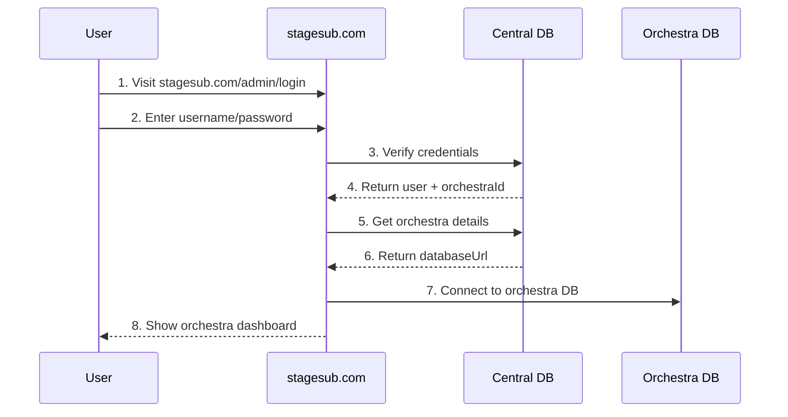
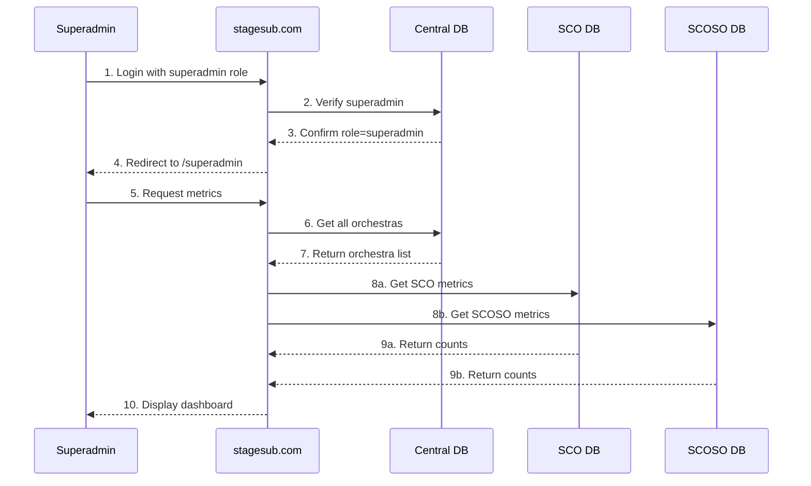
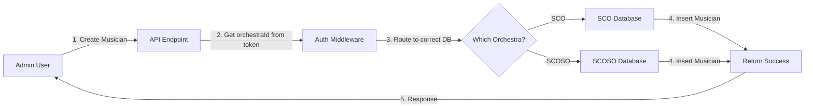
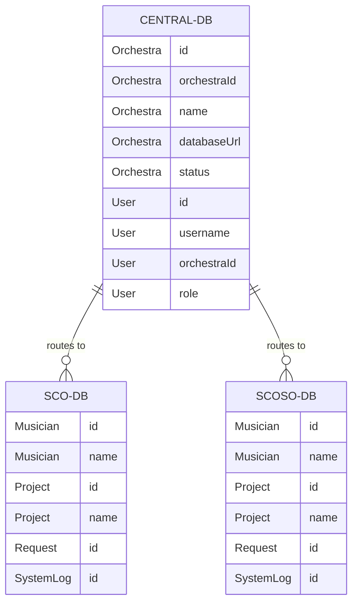
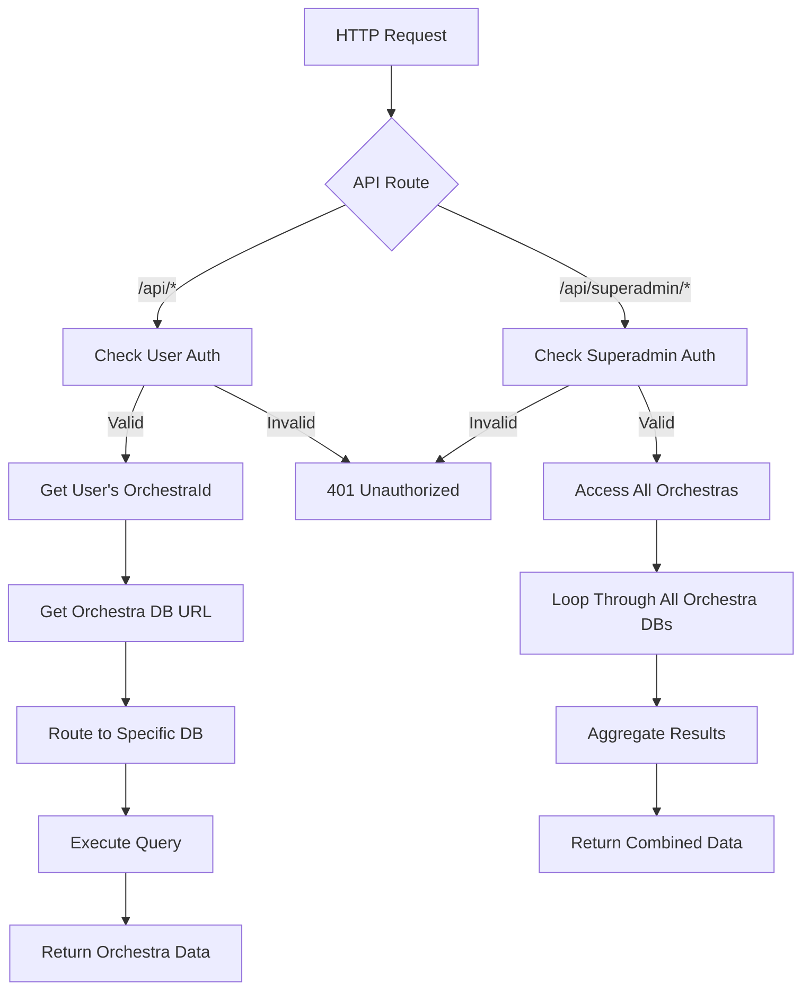
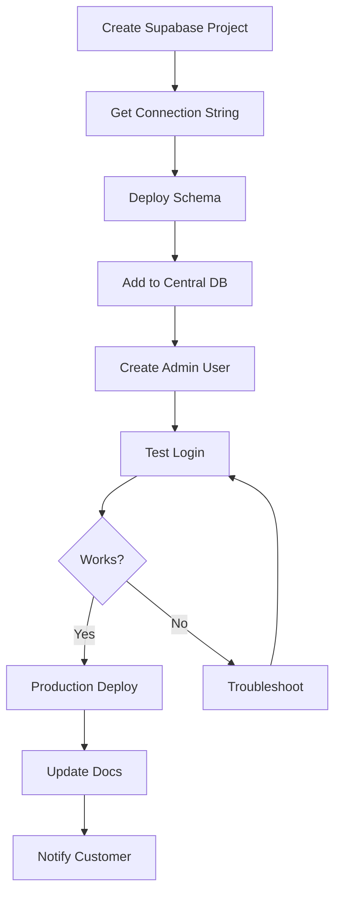
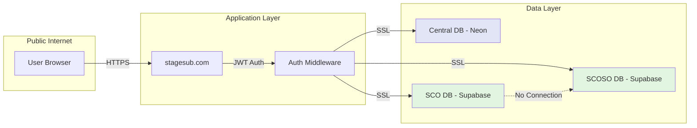

# System Flow Diagrams

## Login Flow - Regular User

## Login Flow - Superadmin

## Data Flow - Creating a Musician

## Database Relationship Diagram

## Request Routing Logic

## Adding New Orchestra Flow

## Security Boundaries

## Key Points Illustrated

1. **Single Entry Point**: All users enter through stagesub.com
2. **No Subdomain Routing**: Authentication determines orchestra, not URL
3. **Complete Isolation**: Orchestra databases cannot communicate
4. **Central Registry**: All routing decisions made via central DB
5. **Role-Based Access**: Superadmin can access all, others only their orchestra
6. **Secure Boundaries**: Each database connection is isolated and SSL-encrypted