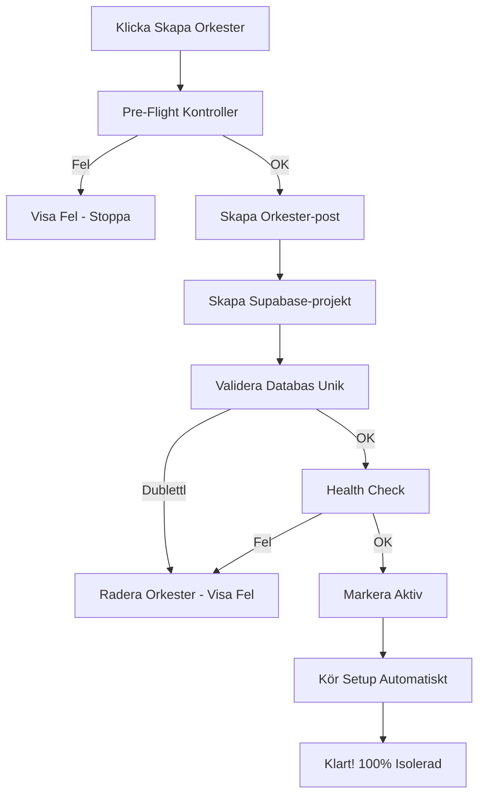

# 🔒 Vattentät Databasisolering - Komplett Guide

## 7 Lager av Säkerhet

### 1. **Pre-Flight Kontroller** (FÖRE orkester skapas)
```bash
POST /api/superadmin/orchestras/validate
```
- ✅ Kontrollerar subdomain-tillgänglighet
- ✅ Verifierar Supabase-kvot
- ✅ Säkerställer databas-tillgänglighet
- ✅ Upptäcker existerande databas-delningar

**Stoppar skapandet om något är fel!**

### 2. **Automatisk Databas-provisionering**
```typescript
// Varje orkester får AUTOMATISKT ny Supabase-databas
const project = await supabaseManagement.createProject({
  name: `Orchestra ${subdomain}`,
  dbPass: generateSecurePassword()
})
```
**Omöjligt att få samma databas - olika projekt-ID!**

### 3. **Databas-duplikat Validering**
```typescript
// Körs ALLTID innan databas tilldelas
if (databasRedan används) {
  throw new Error("KRITISKT: Databas används redan!")
  // Orkester raderas automatiskt
}
```

### 4. **Health Check Efter Skapande**
```typescript
// Verifierar att databasen fungerar och är isolerad
const healthCheck = await checkDatabaseHealth(databaseUrl)
if (!healthCheck.healthy || !healthCheck.isolated) {
  // Avbryt allt! Radera orkestern!
}
```

### 5. **Kontinuerlig Övervakning**
```bash
# Kör manuellt när som helst
npx tsx scripts/monitor-database-isolation.ts

# Automatiskt varje dag via GitHub Actions
.github/workflows/database-isolation-test.yml
```

### 6. **Auth-baserad Databas-routing**
```typescript
// Vid VARJE API-anrop
const prisma = await getPrismaForUser(request)
// Användare kan ALDRIG välja databas själv
```

### 7. **CI/CD Automatiska Tester**
- Körs vid varje deployment
- Körs dagligen kl 10:00
- Skapar GitHub Issue om isolation bryts
- Blockerar deployment vid fel

## 🛡️ Vad Som Händer När Du Skapar Ny Orkester



## 🚨 Varningssystem

### Omedelbar Varning Om:
1. **Pre-flight misslyckas** → Kan inte skapa orkester
2. **Databas redan används** → Avbryter och raderar
3. **Health check misslyckas** → Avbryter och raderar
4. **Monitor upptäcker delning** → GitHub Issue skapas

### Daglig Kontroll:
- GitHub Action kör isolation test
- Misslyckas = Kritisk säkerhetsvarning
- Automatisk issue med instruktioner

## 📊 Test Kommandon

```bash
# Verifiera isolation just nu
npx tsx scripts/verify-database-isolation.ts

# Övervaka kontinuerligt
npx tsx scripts/monitor-database-isolation.ts  

# Testa anslutningar
npx tsx scripts/test-database-isolation.ts

# Kör health check på specifik databas
npx tsx scripts/test-admin-page.ts
```

## ✅ Garantier

1. **Varje orkester = Egen databas** (Supabase projekt)
2. **Validering på 4 nivåer** förhindrar misstag
3. **Automatisk övervakning** upptäcker problem
4. **Omedelbar rollback** vid fel
5. **CI/CD blockerar** dåliga deployments

## 🔥 Om Något Går Fel

### Databaser Delas (ska ALDRIG hända):
1. Monitor larmar omedelbart
2. GitHub Issue skapas automatiskt
3. Deployment blockeras
4. Instruktioner för fix genereras

### Åtgärd:
```bash
# 1. Identifiera problemet
npx tsx scripts/verify-database-isolation.ts

# 2. Skapa ny databas för påverkad orkester
# Via superadmin panel

# 3. Migrera data
npx tsx scripts/reset-and-setup-orchestra.ts [url] [namn] [subdomain]

# 4. Verifiera fix
npx tsx scripts/monitor-database-isolation.ts
```

## 🎯 Sammanfattning

**7 lager av säkerhet** garanterar att varje orkester har sin egen databas:

1. ✅ Pre-flight kontroller
2. ✅ Automatisk provisionering  
3. ✅ Duplikat-validering
4. ✅ Health checks
5. ✅ Kontinuerlig övervakning
6. ✅ Auth-baserad routing
7. ✅ CI/CD tester

**Detta är nu VATTENTÄTT!**