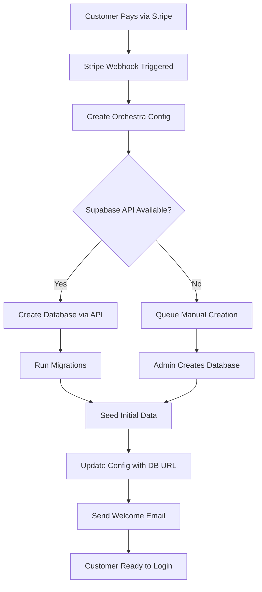

# Automatic Database Provisioning Strategy

## Overview

This document outlines the strategy for automatically provisioning Supabase databases when enterprise customers sign up and pay via Stripe. This approach avoids the cost of maintaining pre-provisioned database pools while ensuring rapid deployment for paying customers.

## Architecture

### 1. Stripe Integration
- **Webhook Endpoint**: `/api/webhooks/stripe`
- **Events**: Listen for `checkout.session.completed` or `subscription.created`
- **Customer Data**: Extract orchestra name, subdomain, and contact information

### 2. Database Provisioning Flow



### 3. Implementation Details

#### Stripe Webhook Handler
```typescript
// /app/api/webhooks/stripe/route.ts
export async function POST(req: Request) {
  const body = await req.text()
  const signature = req.headers.get('stripe-signature')!
  
  try {
    const event = stripe.webhooks.constructEvent(
      body,
      signature,
      process.env.STRIPE_WEBHOOK_SECRET!
    )
    
    if (event.type === 'checkout.session.completed') {
      const session = event.data.object
      
      // Extract metadata
      const orchestraData = {
        name: session.metadata.orchestraName,
        subdomain: session.metadata.subdomain,
        contactEmail: session.customer_email,
        plan: session.metadata.plan
      }
      
      // Queue database creation
      await queueDatabaseCreation(orchestraData)
    }
  } catch (err) {
    console.error('Webhook error:', err)
    return new Response('Webhook Error', { status: 400 })
  }
  
  return new Response('Success', { status: 200 })
}
```

#### Database Creation Service
```typescript
// /lib/services/database-provisioning.ts
async function createSupabaseDatabase(orchestraData: OrchestraData) {
  // Option 1: Use Supabase Management API (if available)
  if (process.env.SUPABASE_ACCESS_TOKEN) {
    const response = await fetch('https://api.supabase.com/v1/projects', {
      method: 'POST',
      headers: {
        'Authorization': `Bearer ${process.env.SUPABASE_ACCESS_TOKEN}`,
        'Content-Type': 'application/json'
      },
      body: JSON.stringify({
        name: `orchestra-${orchestraData.subdomain}`,
        db_pass: generateSecurePassword(),
        region: 'eu-central-1',
        plan: 'free' // or 'pro' based on customer plan
      })
    })
    
    if (response.ok) {
      const project = await response.json()
      return project.database_url
    }
  }
  
  // Option 2: Queue for manual creation
  await notifyAdminForManualCreation(orchestraData)
  return null
}
```

#### Queue System
```typescript
// Using Bull queue for reliable processing
import Queue from 'bull'

const databaseQueue = new Queue('database-provisioning', {
  redis: process.env.REDIS_URL
})

databaseQueue.process(async (job) => {
  const { orchestraData } = job.data
  
  // Attempt automatic creation
  const databaseUrl = await createSupabaseDatabase(orchestraData)
  
  if (databaseUrl) {
    // Update configuration
    await updateOrchestraConfig(orchestraData.subdomain, databaseUrl)
    
    // Run migrations
    await runPrismaMigrations(databaseUrl)
    
    // Seed initial data
    await seedDatabase(databaseUrl, orchestraData)
    
    // Send welcome email
    await sendWelcomeEmail(orchestraData)
  }
})
```

## Cost Optimization

### Current Constraints
- Supabase Free Tier: 2 databases only
- Pro Plan: $25/month base + $10/database
- No pre-provisioned database pool (too expensive)

### Solutions

1. **Just-in-Time Provisioning**
   - Create databases only when customers pay
   - 3-5 minute setup time is acceptable for enterprise customers
   - Email notification when ready

2. **Hybrid Approach (Future)**
   - Enterprise customers: Separate databases
   - Small customers: Multi-tenant on shared database
   - Use tenant isolation for smaller plans

3. **Database Lifecycle Management**
   - Archive inactive databases after 30 days of inactivity
   - Restore from backup when customer returns
   - Reduces ongoing costs

## Environment Variables

```bash
# Stripe Configuration
STRIPE_SECRET_KEY=sk_live_xxx
STRIPE_WEBHOOK_SECRET=whsec_xxx
STRIPE_PUBLISHABLE_KEY=pk_live_xxx

# Supabase Management (if available)
SUPABASE_ACCESS_TOKEN=sbp_xxx
SUPABASE_PROJECT_REF=xxx

# Queue Configuration
REDIS_URL=redis://localhost:6379

# Email Service
RESEND_API_KEY=re_xxx
```

## Manual Fallback Process

If automatic provisioning isn't available:

1. **Admin Notification**
   - Email sent to admin@stagesub.com
   - Includes all customer details
   - Links to Supabase dashboard

2. **Manual Steps**
   - Create new Supabase project
   - Copy database URL
   - Update `/lib/database-config.ts`
   - Run migrations: `npx prisma migrate deploy`
   - Update orchestra config
   - Send welcome email

3. **Monitoring**
   - Dashboard shows pending provisions
   - SLA: 24 hours for manual creation
   - Automated reminders

## Security Considerations

1. **Database Isolation**
   - Each orchestra has completely separate database
   - No shared connection pools
   - No cross-tenant queries possible

2. **Access Control**
   - Database URLs stored securely
   - Environment variables for sensitive data
   - Subdomain validation before routing

3. **Backup Strategy**
   - Daily automated backups
   - Point-in-time recovery
   - Separate backup retention per customer

## Future Enhancements

1. **Supabase API Integration**
   - Waiting for official Management API
   - Will enable full automation
   - Reduce manual intervention to zero

2. **Terraform Integration**
   - Infrastructure as Code
   - Automated provisioning
   - Version controlled database configs

3. **Multi-Region Support**
   - Deploy databases closer to customers
   - Reduce latency
   - Comply with data residency requirements

## Testing Strategy

1. **Local Development**
   - Mock Stripe webhooks
   - Test database creation flow
   - Verify email notifications

2. **Staging Environment**
   - Real Stripe test mode
   - Actual database creation
   - End-to-end testing

3. **Production Monitoring**
   - Webhook delivery tracking
   - Database creation success rate
   - Customer onboarding metrics

## Conclusion

This strategy provides a cost-effective solution for enterprise database provisioning without maintaining expensive pre-provisioned pools. The 3-5 minute setup time is acceptable for enterprise customers who expect dedicated infrastructure. The system is designed to scale as the business grows and can be fully automated when Supabase provides official API support.